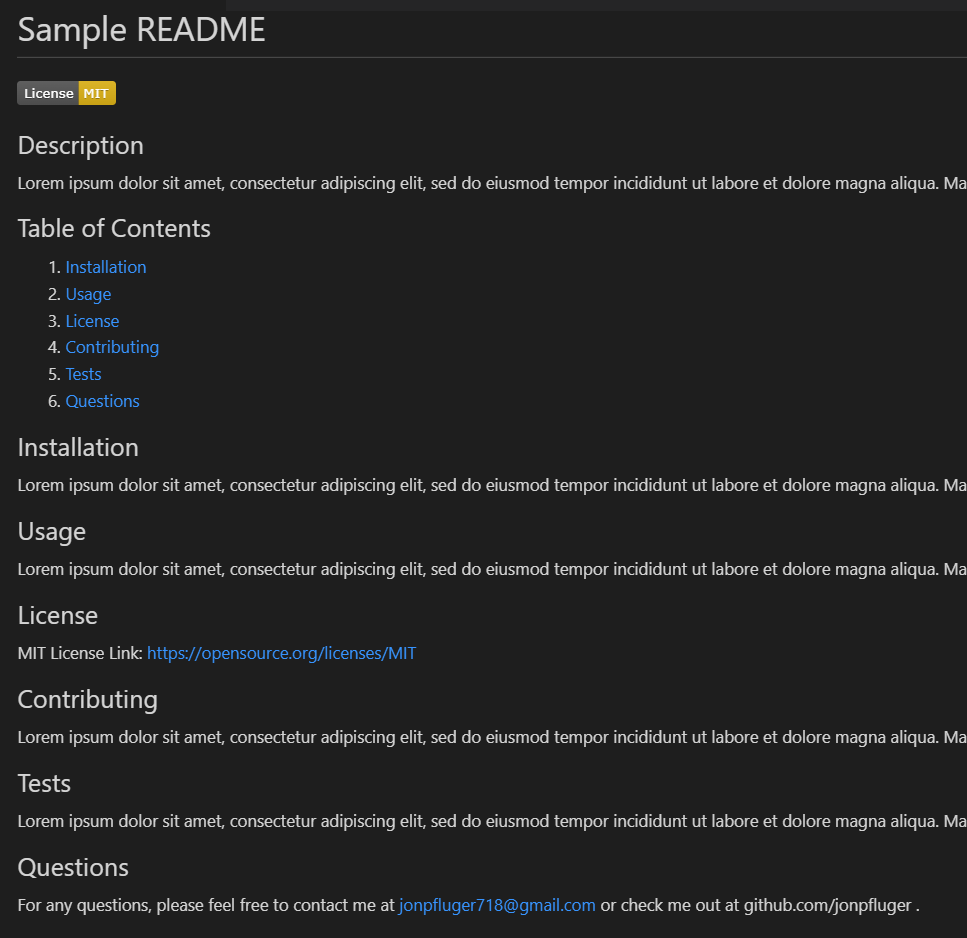

# Professional README Generator

## Description

You can quickly and easily generate a README file by using a command-line application to generate one. This allows the project creator to devote more time working on the project.

## Installation

This application uses the [Inquirer package](https://www.npmjs.com/package/inquirer/v/8.2.4).

## Usage

The application will be invoked by using the following command:

```bash
node index.js
```

## Screenshot of Sample README.md



## Video Instructions


## Questions
For any questions, please feel free to contact me at jonpfluger718@gmail.com or check me out at github.com/jonpfluger .
